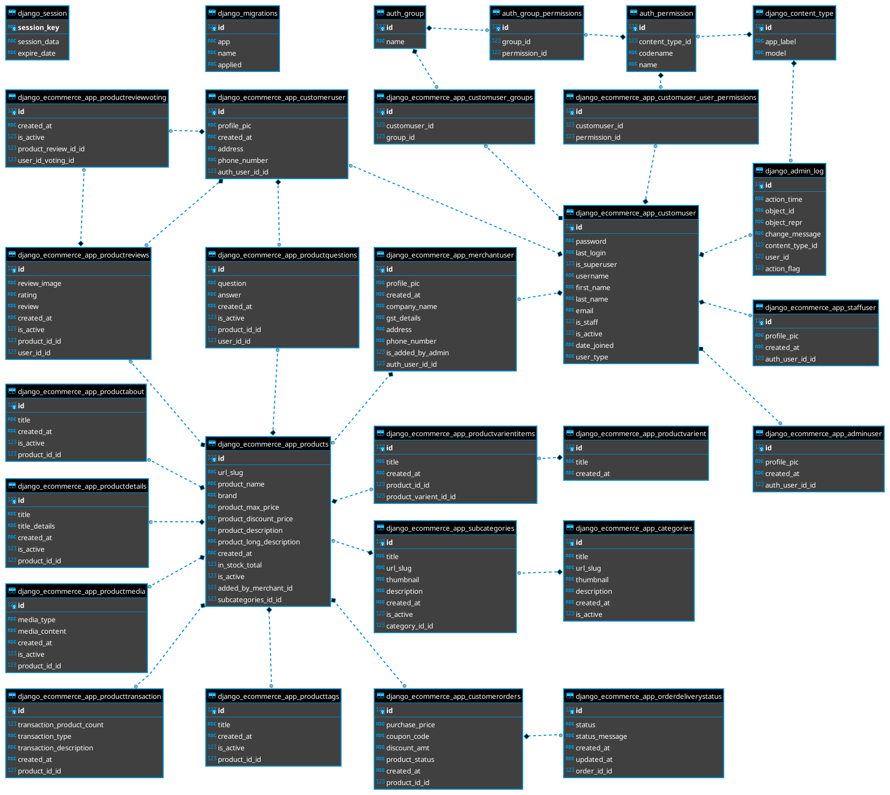

# DJANGO ECOMMERCE PROJECT
### How to run
##### 1. Terminal:
* `python3 manage.py runserver`

or:
* `python3 manage.py makemigrations`
* `python3 manage.py migrate`
* `python3 manage.py createsuperuser`
* `python3 manage.py runserver`

##### 2. Browser:
* 127.0.0.1:8000/admin

----------
#### [Le Tuan Luc](https://github.com/often127)
#### [Pham Quan](https://github.com/quanpham1008)
##### Thanks to [Luong Anh Tuan]() and [Hackstartsj]()

### ER DIAGRAM
